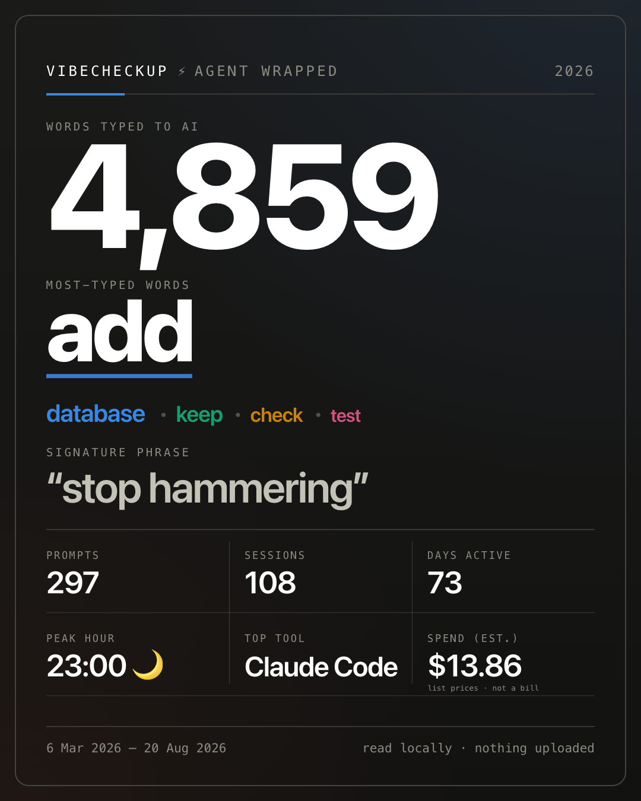
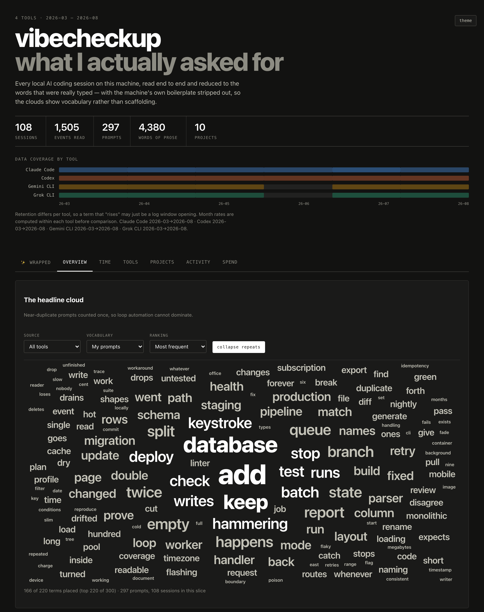

<div align="center">

# vibecheckup

**A local vibecheckup on your AI coding year.**

One command reads the session logs already on your machine — Claude Code, Codex,
Grok CLI, Gemini CLI, Antigravity, Cursor — and builds a single self-contained
`dashboard.html`: your **Agent Wrapped**, your **Lexicon**, your **Spend**.

Nothing is uploaded. Nothing is installed either — no packages, no system-wide
install, nothing on your PATH; `python3` is the only requirement.

[](LICENSE)
[](https://www.python.org/)


<!-- assets/wrapped-card.png — the Agent Wrapped share card, generated from
     `./vibecheckup.sh --demo` so it contains no real vocabulary. -->


</div>

---

## Start here

**Copy this to your agent:**

```text
Read https://github.com/chensagics/vibecheckup. Before running anything, tell me
in your own words what vibecheckup does, what it reads, and where my data goes,
then ask if I want to proceed. If I say yes, install and run it, then open the
dashboard.
```

It reads the docs, tells you in its own words what the tool touches, and sets it
up once you agree. Works in Claude Code, Codex, Gemini CLI, or anything else
that can read a repo and run a script.

**Or run it yourself.** `python3` 3.9+ on macOS or Linux is the whole
requirement — no pip, no packages, nothing added to your PATH:

```bash
git clone https://github.com/chensagics/vibecheckup.git
cd vibecheckup
./vibecheckup.sh
```

(On Windows, run it under WSL or Git Bash. On a bare Mac, the script points you
at `xcode-select --install`.)

Either way, one run reads the AI-session logs already on this machine, writes a
single self-contained `dashboard.html` beside the script, and opens it in your
browser. It takes well under a minute, it uploads nothing, and re-running just
refreshes — there is no cache to go stale.

**Want to look before pointing it at your own logs?**

```bash
./vibecheckup.sh --demo     # same dashboard, synthetic corpus, real logs untouched
```

**Planning to send it to someone?** The dashboard holds your project names,
your shell commands and the raw error text your tools hit. Build the redacted
copy instead — and read [Privacy](#privacy) before you post anything:

```bash
./vibecheckup.sh --scrub    # also writes dashboard-shareable.html, and opens that
```

**Nothing found?** It reads Claude Code, Codex, Grok CLI, Gemini CLI,
Antigravity and Cursor; any it cannot find are skipped and named in the run
report. The exact paths are in [Sources](#sources).

→ [What you get](#three-faces-of-one-file) · [Other ways to run it](#other-ways-to-run-it) · [Where your data goes](#privacy)

---

## Three faces of one file

### ✨ Agent Wrapped — the landing view

A full-screen slide sequence, Spotify-Wrapped style: how many words you sent to
an AI this year, how many prompts and sessions, your top words and your signature
phrase, your peak hour and weekday, your longest streak and busiest day, how
you actually felt about it — praise, exasperation, urgency, swearing, not just
*please* — the words the **model** reaches for that you never do, which tool
you actually live in, what it would have cost. It ends
on a share card drawn to a `<canvas>` with a **Download PNG** button — branded
`VIBECHECKUP ⚡ AGENT WRAPPED 2026`, with **no directory names and no file
paths — but the words come out of your prompts**, so read them before posting. Tap any word on the card to drop it and the next one moves
up. Slides whose stat is missing are skipped, not faked.

### Lexicon — what you actually say to an AI

Word clouds over your real prompts: the headline cloud, then what is
*distinctive* about each tool and each project rather than what they have in
common, phrases that survive as phrases (`dev server`, `word cloud` — two words
with a space between them, never a JSON key and its value), and terms
rising or fading month over month. The question it answers: **what do I actually
ask AI to do, how has that changed, and how does it differ per tool and per
project?**

### Spend — what your year would cost at list prices

Token usage is extracted natively from the same logs — no Node, no `ccusage` at
runtime — and priced from a bundled table: total, rolling 7 / 30 days, cache-hit
rate, cost per day, spend by model and by tool. Grok CLI and Antigravity log no
usage at all and are badged **no usage data** instead of being counted as zero.
Cursor is in between: it stamps a token count on a minority of messages and
names no model for them, so its tokens are counted and reported unpriced.

<!-- assets/dashboard.png — the Overview tab: the coverage rail and the
     headline cloud. Generated from `./vibecheckup.sh --demo` so it contains no
     real vocabulary. -->


## Other ways to run it

[Start here](#start-here) covers the two normal paths. This section is the rest:
asking your agent for a verdict, installing without a clone, pinning a release,
and every flag.

**Asking the agent what it found.** The prompt above stops at opening the
dashboard. Add *"then read the stats it generates and tell me what a year of my
prompts says about me"* if you want its read on you — but know what that hands
over: your `stats.json` is your vocabulary, your project names, and the raw
error text your tools hit, and an agent pointed at the rest of `data/` sees
`vocab.json` and `redact.json` too. The local run uploads nothing; that last
step is the exception, and the dashboard answers the same questions without it.

**Or one line**, if you would rather not clone. No pip, no dependencies — it
unpacks this repo into `~/.vibecheckup` and runs from there. That directory is
the only thing it leaves behind, and a clone avoids even that:

```bash
curl -fsSL https://raw.githubusercontent.com/chensagics/vibecheckup/main/vibecheckup.sh | sh
```

That tracks `main`, which is a moving target: you are trusting whatever is on
the branch at the moment you run it. To pin a release instead, swap the branch
for a tag and check the hash first — the script is short enough to read in a
sitting, and reading it is the point:

```bash
curl -fsSL https://raw.githubusercontent.com/chensagics/vibecheckup/v0.1.0/vibecheckup.sh -o vibecheckup.sh
shasum -a 256 vibecheckup.sh    # compare against the release notes
sh vibecheckup.sh
```

If you fork or rename, override the source with `VIBECHECKUP_REPO=owner/name`
(and `VIBECHECKUP_BRANCH=tag` to pin what the bootstrap fetches).

| Flag | Effect |
|---|---|
| `--demo` | Build from a deterministic synthetic corpus (`samples/generate.py`). Never touches your real logs. |
| `--force`, `-f` | With `--demo`, overwrite an existing `data/events.ndjson` without asking. |
| `--scrub` | Also write `dashboard-shareable.html` — the same page without project names, error text, shell commands or MCP server names — and open that one. `dashboard.html` is still written, unchanged. See [Privacy](#privacy). |
| `--tool NAME` | Limit ingest to one source; repeatable. `claude_code`, `codex`, `grok`, `gemini_cli`, `antigravity`, `cursor`. |
| `--limit N` | Cap files per source — a quick smoke run. |
| `--no-open` | Build the dashboard but don't open a browser. |
| `-h`, `--help` | Usage. Answered before anything is downloaded, so `curl … \| sh -s -- --help` costs nothing. |

Environment: `VIBECHECKUP_REPO` / `VIBECHECKUP_BRANCH` (what the one-liner fetches)
and `VIBECHECKUP_HOME` (where it lands, default `~/.vibecheckup`).

The script is a thin wrapper over three stages you can also run yourself:

```bash
python3 ingest.py                  # all session logs  -> data/events.ndjson
python3 analyze.py                 # events            -> data/stats.json
python3 build_dashboard.py         # stats + template  -> dashboard.html
python3 build_dashboard.py --scrub # ... and dashboard-shareable.html
```

Standard library only, so those three run anywhere `python3` does — a full pass
re-reads a few thousand files in well under a minute.

The wrapper is a POSIX shell script, which is why Windows goes through WSL or
Git Bash: the log paths it reads are the ones your tools write *inside* that
environment.

## Privacy

**Everything runs locally: nothing this tool does sends your session data
anywhere.** The pipeline makes no network calls at all: `ingest.py`,
`analyze.py` and `build_dashboard.py` only read files and write files, and the
dashboard opens over `file://`. The one network call in the project is the
`curl` bootstrap above, which downloads this repo when there is no checkout.
What leaves your machine is what you choose to send — a share card, a share
copy, a `stats.json` handed to an agent — and the rest of this section is about
making those choices with the facts in front of you.

- **The repo ships no user data.** `data/`, `snapshots/` and `dashboard.html`
  are gitignored, because they contain your real vocabulary, project names and
  local paths. Two files inside `data/` earn that on their own account.
  `vocab.json` is the vocabulary tail behind `stats.json` with the top-N cut
  taken off, which makes it the longer and more exposing of the two, not the
  safer one. `redact.json` is the denylist, and a denylist spells out the
  branch names — live A/B arms, unreleased features — you wanted hidden. Treat
  both exactly as you treat `dashboard.html`. `dashboard-shareable.html` is
  gitignored too — it is safe to hand to a person, which is not the same as
  belonging in a commit.
- **`dashboard.html` inlines everything in `stats.json`, verbatim.** That is
  what makes it a single file you can keep — and it means the file carries your
  project and worktree directory names, one word cloud per repo, every shell
  command your agents ran, and the *What went wrong* facet. That facet is one
  line quoted out of each failing tool result — chosen by the diagnostic
  markers a machine puts in one, then masked for URLs, addresses, paths,
  hostnames, hashes, commit subjects and your own account name. It is still
  text lifted off your machine rather than words you typed, and the selection
  is a heuristic: where a short tool result carries no marker at all its first
  line is taken anyway, so a line that was never a failure can land there.
  Treat the file as private, and treat **screenshots of the Projects and
  Activity tabs** the same way: both are lists of your repo names.
- **`--scrub` is how you make a copy you can hand over.**
  `python3 build_dashboard.py --scrub` (or `./vibecheckup.sh --scrub`) writes a
  separate `dashboard-shareable.html` and leaves `dashboard.html` alone. It
  removes the whole `clouds.by_project` facet, every `errors` list, every
  `commands` list and the session ids; it replaces the repo names in the
  Activity table with `project 01`, `project 02`, … so the shape of your year
  survives without the names; it cuts the server name out of every MCP tool, so
  `mcp__meta-ads__ads_get_ad_entities` becomes `mcp:ads_get_ad_entities` and
  the Tools view stops being an inventory of the vendors you are wired to; and
  from the clouds that remain it drops any term matching your account name or
  one of your project names, or carrying a dot between two word characters — a
  filename, hostname, bundle id or path. What is left is the global and
  per-tool prose clouds, phrases, trends, spend, the activity histograms and
  Wrapped. The page says `SHARE COPY` in its footer and on its Spend tab, so a
  recipient can tell which one they were given.
- **What `--scrub` does not do is read your mind.** The clouds it keeps are
  still your own prose, so an unreleased codename that ran through your prompts
  all year is still an unreleased codename that ran through your prompts all
  year — the scrub removes strings harvested
  from your machine, not vocabulary. Its identifier rule is a rule about the
  dot and nothing else: `buildbox.internal` goes, `buildbox` stays, and so do
  `acmecorp-prod-eu` and `macbookpro18`, because on the page nothing separates
  them from an ordinary word. Widening the rule would cost real vocabulary;
  `--redact` is the answer for a name you know about. The tool half of an MCP
  call is kept too, and a distinctive one still implies its server. Read the
  page before you send it.
- **A snapshot outlives the rules that built it.** `snapshot.py` copies the
  built page into `snapshots/`, and what was redacted out of that copy is a
  property of the build, not of your checkout. Every page is stamped with the
  redaction-schema version it was made under, and `snapshot.py --list` marks
  anything below the current one `PRE-REDACTION, rebuild before sharing`.
  Rebuilding is the fix — the old file keeps whatever the old rules let
  through, and nothing on its face says so.
- **The strings that identify you are masked in every build — except the ones
  each run tells you it skipped.** vibecheckup works out who you are from your
  account name, your git name and email, and the account half of your git
  remotes, and removes those strings from the word clouds, along with the
  worktree branch names it sees while grouping sessions by repo, because an
  unreleased feature name is not vocabulary. There is a guard on that, because
  redacting the wrong string deletes a word out of every cloud: it will not
  auto-mask anything that is also an ordinary word (`mark`, `will`, `sam`,
  `docs`, `main`), and for the sources it is only guessing from — a home
  directory's name, a git remote's owner — it will not auto-mask anything under
  five characters either. Every run therefore prints a **`NOT masked`** line
  naming what it refused and why. That line, not this paragraph, is the
  accurate list; `--redact` anything on it you want gone.

  To add what it cannot work out for itself — a codename, a client, a handle, or
  one of those skipped words — pass `--redact`:

  ```bash
  ./vibecheckup.sh --redact acme-corp --redact bluesky
  ```

  It is repeatable and also works on `ingest.py` and `analyze.py`. For strings
  you always want masked, put one per line in
  `~/.config/vibecheckup/redact` (`#` starts a comment), or point
  `$VIBECHECKUP_REDACT_FILE` elsewhere. Explicit strings skip the guard
  entirely, length check and common-word check both — if you say it is yours,
  it goes. `--branch-redaction decorated` masks only the `worktree-<branch>`
  spellings and leaves the bare branch name; `off` disables branch masking
  entirely.
- **The Wrapped card carries no directory names and no file paths** — that rule
  is enforced in `wcstats/wrapped.py`, not in the page, so it holds for anything
  built from `stats.json`. **The words on it are a different matter: they come
  straight out of your own prompts**, and a product codename that ran through
  them all year can land at the top of the list. **The card also prints one dollar
  figure: your estimated spend for the whole year.** It is a list-price estimate
  rather than a bill, but it is still a number about you, in an image people
  post publicly. Read the card before posting it, and tap any word to drop it —
  the card and the PNG both redraw without it. You choose what to share: the
  card is a PNG you download, not something this tool posts anywhere.
- **The Wrapped deck is a share surface too, not just the card.** Only the card
  has a Download button, but a screenshot of any slide works just as well, and
  the slides carry more than the card does: your spend total and the date of
  your priciest day, the date of your busiest day, your peak hour and weekday,
  and how many times *please*, *thanks* and *sorry* appeared in your prompts.
- Emotion counters and every word cloud run over *cleaned* prose, so a
  "please" injected by a hook or a skill definition is filtered out before it
  can be counted. Tone and habit are read only from prompts short enough that a
  person plausibly typed them: a 3,000-word pasted brief counts toward how much
  you sent, never toward how you sound.
- **A prompt is whatever arrived in your turn.** That is what the tool can
  honestly claim, and the copy is written to claim exactly that and no more.
  Typing, pasting a stack trace, and a skill definition the harness folded into
  your message all land in the same event, and nothing downstream can tell them
  apart. So the page says *words sent to AI*, *your most-used words* and *it
  came up in your prompts* — never *you typed this*. `wcstats/clean.py` throws
  out as much machine text as shape alone can identify — injected blocks, code,
  paths, log lines, `ls -l` rows, and JSON/YAML/TOML config regions — but it is
  a filter, not a witness: it can tell config from prose, and it cannot tell
  your hands from your clipboard.
- The built page makes **no** network requests at all: no fonts, no scripts, no
  images fetched from anywhere. It renders identically on a machine that has
  never been online. That is a security property and not a privacy one — the
  page never phones home because it never needs to, since everything it shows is
  already inside the file you are holding.

## Costs are estimates, not a bill

Every dollar figure is a **list-price estimate** computed here from the token
counts in your own logs. It is not an invoice and it is not fetched from any
billing API. On a subscription plan your real cost is the flat fee — read these
numbers as a relative signal (which days, models and tools are heavy), never as
what you owe.

Rates live in [`wcstats/prices.json`](wcstats/prices.json), one line per model
pattern, matched as a prefix so dated and codenamed variants resolve to their
family. Anthropic rates are published list prices; the OpenAI, Google and xAI
entries are explicitly labelled `ESTIMATE` where a codename has no published
rate card. A model that matches nothing is reported as **unpriced with a null
cost — never silently zeroed**. Rates change: PRs against that file are welcome
and are the cheapest possible contribution.

## Sources

| Tool | Location | Notes |
|---|---|---|
| Claude Code | `~/.claude/projects/**/*.jsonl` | includes nested `subagents/` transcripts; priced |
| Codex | `~/.codex/sessions/**/rollout-*.jsonl`, `archived_sessions` | priced; cumulative token totals, see below |
| Grok CLI | `~/.grok/sessions/<enc-cwd>/<id>/chat_history.jsonl` | no per-message timestamps, no usage data |
| Gemini CLI | `~/.gemini/tmp/*/chats/session-*.json` | plain JSON; priced |
| Antigravity | `~/.gemini/antigravity-cli/conversations/*.db` | SQLite + schema-less protobuf; heuristic, no usage data |
| Cursor | `<app data>/Cursor/User/globalStorage/state.vscdb` | one SQLite key/value store for every chat; see below for what it does and does not keep |

## How it works

**`ingest.py`** runs one adapter per tool. Adapters *classify* — they map a
source record type onto a `(role, kind)` pair — and never judge text by content.
Every file is parsed independently: a malformed line is counted and skipped,
never fatal. Each run prints a per-tool report of files parsed, bad lines, and
any record type the adapter did not recognise, so a silent upstream format
change shows up instead of quietly dropping data.

**`analyze.py`** does the content work, and most of the value is in what it
throws away. A typical Claude Code session holds a handful of real prompts against
hundreds of tool results and hook attachments — unfiltered, the corpus is **mostly machine
text**, and every cloud reads *skill, important, file, the*. `wcstats/clean.py`
strips injected context (hook output, skill definitions, agent-history
injections, CLAUDE.md echoes), fenced and unfenced code, file dumps, diffs, and
log lines.

It also strips **structured data** — JSON, YAML, TOML, schemas — and that one
took a bug to find. A settings schema pasted into a prompt is not fenced, is not
markup, and arrives *inside* a user turn, so nothing else in the pipeline could
see it: the shipped card announced `type string` as the owner's signature
phrase, 435 times, out of `"type": "string"`. The filter works on **regions**
rather than whole messages, because the real shape in the corpus is a typed
question followed by a pasted blob and throwing away the message throws away the
question. Exactly one line shape is decisive on its own — a quoted identifier
key before a colon — and the ambiguous ones (`key: value`, a lone quoted value,
a closing brace) only go when they sit inside a run that has something decisive
in it. `Note: read this first` is prose, and stays prose even when the line
under it is a schema.

Scoring goes past raw counts:

- **Frequency, counted once per prompt.** A term counts once per message
  however often that message repeats it, so "most used" means "used in the most
  separate prompts". This is what stops one paste buying the headline: a
  translation table that said `السعر` 120 times had put it tenth in a human
  being's most-used words.
- **Log-odds with an informative Dirichlet prior** for every comparison facet.
  Raw counts make each tool and project look identical; this surfaces what is
  *distinctive* about one against the whole corpus.
- **PMI collocations**, so `dev server` and `word cloud` survive as phrases. A
  candidate pair has to have been *adjacent, with a space between the words* —
  the same bug that produced `type string` produced it by bridging the `": "`
  between a JSON key and its value, and a phrase that spans a colon is not a
  phrase anyone said.
- **Month-over-month rate deltas** for rising and fading terms.

Near-identical automation prompts are clustered by shingle key and counted once
by default, with raw counts available via a toggle. The same key gates the
wrapped counters, so an automation prompt fired once per repo cannot pass for a
phrase used across fourteen projects.

**The signature phrase is picked on breadth, not volume.** A topic is dense
inside one codebase; a habit turns up wherever you are working, so candidates
rank on how many distinct projects use them and only then on how often. That
pool keeps function words — a habit is made of the words the stopword list
exists to throw away, and a content-word pool can only ever hand you a domain
noun pair.

**The model's voice is scored against yours.** Both sides of a coding session
say "file" and "run" constantly, so a frequency list of the model's words is
your own list with the names changed. The Wrapped shows log-odds instead: the
register only it uses. Its thinking is excluded — 43% of its prose, and it does
not sound like anything it said to you.

**`wcstats/spend.py`** prices the usage the adapters extracted, per component.
Adapters normalise `input` to be cache-exclusive, so the buckets are disjoint
and simply add; only the *rate* differs by provider. Anthropic bills cache reads
and cache writes as their own lines, while OpenAI/Google-style `cached` input is
a discounted subset of input and is billed at the `cached_input` rate.
Reasoning and thinking tokens price as output. Codex reports `total_token_usage`
cumulatively per session and re-emits it on idle, so per-turn usage is recovered
by differencing consecutive snapshots — a repeat differences to zero. Summing
instead overcounted a long multi-hour rollout by about a third. That trap is
locked down by a regression test.

**`build_dashboard.py`** inlines `stats.json` into the template. The data is
embedded rather than fetched because the `file://` origin policy blocks a
sibling `fetch()`, and a single file opens by double-click — and stays readable
years later, offline, with no server.

### Retention is uneven, and that would lie to you

Retention differs sharply per tool — Codex reaches back to January, Claude Code
and Grok keep about five weeks. A naive time series would report log rotation as
a change in behaviour. Month rates are therefore computed *within* each tool
before comparison, and the dashboard's coverage rail shows exactly which tools
have data in which month.

### Antigravity is best-effort, and says so

Antigravity stores conversations as SQLite DBs whose `steps.step_payload` column
holds protobuf with no available schema. `adapters/protoscan.py` walks the wire
format generically and recovers strings; `step_type` was mapped to roles
empirically by reading extracted text across a 40-conversation sample. Every
event from this adapter carries `confidence: "heuristic"` and is badged as such
in the dashboard.

### Cursor keeps everything in one database, and not all of it

Cursor has no per-session file. Every chat lives in one SQLite key/value store,
`cursorDiskKV`, under three keys that matter: `composerData:<id>` is the
conversation, `bubbleId:<composerId>:<bubbleId>` is a message, and the rest is
editor state. Bubble `type` is the record type — **1 = user, 2 = assistant** —
and an assistant bubble is sub-classified by `capabilityType` into a prose
reply, a tool call, or a reasoning summary. Those are named JSON fields with a
discriminator Cursor repeats in its own header index, so every event is
`confidence: "exact"`, unlike Antigravity above.

**Recovered:** prompts, replies, tool calls with their arguments and results,
shell commands and exit codes, tool failures, per-message timestamps, and the
project — resolved from the folder URI the bubbles carry, or failing that by
joining the conversation id against the per-workspace databases in
`workspaceStorage/`, which hold a `workspace.json` naming the folder. A chat
that resolves to no folder is labelled `unknown`; the workspace hash is an
opaque local id and is never published as a project name.

**Not recovered, on purpose or because it is not there:**

- `composerData.conversation` is empty and message order comes from
  `fullConversationHeadersOnly`. It disagreed with a timestamp sort in 3 of 7
  local conversations, so the header list wins.
- Token counts exist on a minority of messages only, and the messages that have
  them name no model — Cursor records its "Auto" setting rather than what ran.
  Those tokens are counted and reported **unpriced** rather than guessed at.
  There is no cached-input figure at all, so the cache columns read 0.
- Most reasoning summaries hold only the provider's *encrypted* signature with
  an empty text field; Cursor cannot show them either. Here that was 76 of 94.
- The per-workspace `aiService.prompts` lists duplicate the user bubbles with no
  timestamps, so they are skipped — reading both would double every prompt.
- `agentKv:` holds assembled request payloads — system prompt, injected rules,
  tool schemas — which nobody authored, and a quarter of them are binary. Not
  read.
- Cursor prunes conversations before their messages: 50 of 57 composers here had
  no messages left. Nothing can recover those.

Cursor's databases are opened **read-only, always**, and with the same
`immutable=1`-then-fall-back dance the Antigravity adapter uses: `immutable=1`
makes SQLite ignore the write-ahead log, which on a database Cursor is still
writing to looks exactly like corruption.

### The palette has six slots, and the sixth was the hard one

Each source gets one categorical colour (`--s1`…`--s6`). The sixth sits in the
one hue gap the other five leave, between `--s1` blue and `--s5` pink — but a
purple at the same *lightness* as `--s1` is precisely what a deuteranope cannot
tell from it, and in dark mode that pair fell to ΔE 1.1. So `--s6` is deliberately
dark for its hue in both themes: it clears ΔE 9.6 (dark) and 10.3 (light)
against every other slot under simulated protanopia and deuteranopia, above the
ΔE 8 target, while still holding 3:1 contrast against both surfaces. Adding it
made no pair in the palette worse than it already was.

## Layout

```
vibecheckup.sh        bootstrap: check python3, run the three stages, open the page
ingest.py  analyze.py  build_dashboard.py  dashboard_template.html
adapters/   base.py protoscan.py claude_code.py codex.py grok.py
            gemini_cli.py antigravity.py cursor.py
wcstats/    clean.py tokenize.py score.py facets.py spend.py wrapped.py
            prices.json
samples/    generate.py         deterministic synthetic corpus for --demo
tests/      test_all.py test_bootstrap.py test_i18n_time.py test_projects.py
            test_redaction.py test_scrub.py test_selfredact.py
            test_snapshot.py test_vocab_gate.py test_wrapped_quality.py
            fixtures/
snapshot.py                     keep a dated copy of a built dashboard
                                (--scrub keeps the shareable one instead;
                                 --list flags copies built by older rules)
data/       events.ndjson stats.json vocab.json redact.json
                                                    (generated, gitignored)
dashboard.html                                      (generated, gitignored)
dashboard-shareable.html        only with --scrub   (generated, gitignored)
```

`stats.json` keeps top-N per facet so the dashboard loads instantly.
`vocab.json` is the tail below that cut — gated, but longer and more exposing
than `stats.json` rather than less. `redact.json` is the denylist `ingest.py`
worked out, which is a list of exactly the strings you wanted hidden. Both are
private files; see [Privacy](#privacy).

## Development

```bash
python3 -m unittest discover -s tests   # fixtures only, no network
./vibecheckup.sh --demo --no-open         # full pipeline on synthetic data
```

**503 tests on a fresh clone, 523 once you have built a dashboard.** The
difference is the checks that read `data/stats.json` and `dashboard.html`; with
nothing built yet they skip rather than fail, so a clone with no logs still runs
green.

The rest run entirely on checked-in fixtures — they never read your real logs.
The fixture suite covers adapter classification, the cleaner, the scoring maths,
pricing (including the Codex cumulative-total trap and the unknown-model null),
the `stats.json` contract, the inlining that keeps a stray `<script` in your
logs from blanking the page, and the bootstrap script's argument handling.
`tests/test_scrub.py` seeds a synthetic corpus with a fake account name, fake
repo names, fake error text and fake MCP server names, then greps the built
share copy for every one of them — the leak has to be visible in the unscrubbed
build for the same test to pass, so a zero cannot come from an empty fixture.

## Roadmap

- Multi-device rollup (each machine publishes a snapshot, one dashboard merges).
- A Cursor adapter.
- Live / auto-refreshing mode.
- Price-table auto-update.

## Acknowledgements

Inspired by [**ccusage**](https://github.com/ryoppippi/ccusage) by
[@ryoppippi](https://github.com/ryoppippi), which showed that local agent logs
are enough to answer the spend question, and by the Spotify Wrapped format,
which showed that a year of data is worth more as a story than as a table.
vibecheckup computes its own estimates natively in Python and bundles neither.

## License

[MIT](LICENSE) © Chen Sagi
